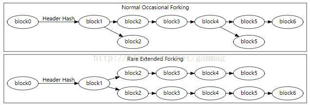

任何算出块头的hash值低于目标阈值的Bitcoin矿工可以将整个块添加到块链上（假设块有效）。这些块通常由它们的块高度 定位的 - 即它们与第一个比特币块之间的块数量（块0，最通常称为创世块）。例如，块 2016是可以首先调整难度值的地方。

多个区块可能有相同的区块高度，当2个或多个矿工在大致相同时间内产生合适新区块的时候这很常见。这在块链中产生了一个明显的分叉，如上图所示。

当矿工同时在区块链尾部产生新区块，每个节点独立选择接受哪个区块。在没有其他考虑的情况下，如下所述，节点通常使用他们看到的第一个块。

最终，一个矿工产生另一个块，它只附加在一个竞争同时开采的块中。这使得叉的那侧比另一侧更强。假设一个分叉仅包含有效区块，正常节点通常紧接着最难的链来增长，抛弃那些属于短分叉的过期区块。（过期块有时也称为孤儿或孤儿块，但是这些术语也用于没有已知父块的真孤儿块）

如果不同的矿工工作在相反的目的，例如一些矿工努力扩展块链，同时其他矿工正在尝试发起51％的攻击来修改交易历史，则长期分叉是可能的。

由于在区块链 的分叉中，多个块可以具有相同的高度 ，区块高度不应该被用作全局唯一标识符。反而，块通常由它们的块头的哈希引用（通常以字节顺序颠倒，十六进制形式）。
