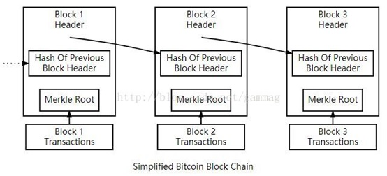

# 链结构

上图显示了区块链的简化版本。一个或多个新交易的块被收集到一个区块的交易数据部分中。每个交易数据的副本将被哈希, 这些哈希值两两配对，再被hash，直到得到最顶层的一个hash值，这就是一棵merkle树的根。
merkle树根存储在这个区块标头中。每个块还存储着先前块的标头的哈希值，这样块将链接在一起。这样可以确保事务无法修改，而不修改记录该事务的块以及所有后续块。
交易记录也被链接在一起。比特币钱包软件给人的感觉是从钱包发送或接收多少聪(satoshi，单位)的比特币，但实际上比特币真的是在交易中流转。每个交易花费先前在一个或多个较早的交易中接收到的多少聪的比特币，因此一个交易的输入是先前交易的输出。
单个交易可以创建多个输出，就像发送到多个地址时的情况一样，但是特定交易的每个输出只能是在区块链中用作输入一次。任何后续的引用都禁止重复花费 - 尝试花费相同的多少聪的比特币两次。
输出绑定到交易标识符（TXID）上，这是验证过的交易的哈希值。

