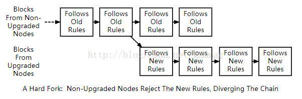
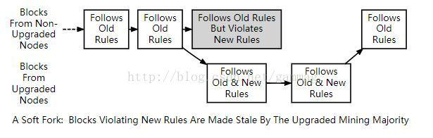

为了维护共识，所有全部节点使用相同的共识规则验证块。然而，有时共识规则要被改变以引入新功能或阻止网络被滥用。当新规则实施时，可能会有一段时间，当未升级的节点遵循旧规则并且升级节点遵循新规则时，导致两种可能的方式打破共识：

遵循新共识规则的块被升级后节点接受，但被未升级的节点拒绝。例如，在块中使用新的交易功能：升级节点了解该功能并接受该功能，但未升级的节点拒绝因为它违反了旧的规则。

违反新的共识规则的块被升级后节点拒绝，但被未升级的节点接受。例如，在块中使用了滥用交易功能：升级后节点拒绝它，因为它违反了新规则，但未升级的节点接受它，因为它遵循旧的规则。

# 硬分叉
第一种情况，被未升级的节点拒绝，那些从其他未升级节点获取区块链数据的挖矿软件拒绝和那些从升级过的节点获取数据的挖矿软件在同一条链上创建。这将创建永久性发散的链 - 一个用于未升级的节点，一个链接用于升级节点-- 这被称为硬分叉。

# 软分叉
第二种情况，被升级后的节点拒绝，如果升级后的节点控制着主要的hash速率则可能阻止区块链永久发散。这是因为，在这种情况下，未升级节点和升级过的节点一样接受相同的快，所以升级后的节点可以创建一个更强的链，也被未升级节点所接受。这被称为软分叉。

# 用户激活软分叉

虽然一个分叉实际上是区块链上发散，共识规则的改变经常被描述为它们潜在地创建一个硬分叉或者软分叉。例如，“将块的大小增加到1 MB以上需要一个硬分叉。在这个例子中，一个实际的块链 分叉不是必需的 - 但这是一个可能的结果。

共识规则的改变可能会以各种方式激活更改。在Bitcoin的前两年，中本聪同过发布立刻强制使用新规则的向后兼容的客户端改变执行了几次软分叉。已经通过标记日激活了多个软叉，例如BIP30，其中新规则开始在预设时间或块高度强制执行。通过标记日激活的分叉被称为用户激活软分叉，因为他们取决于足够多的用户节点在标记日之后强制使用新规则。
稍后软分叉等待多数哈希速率（通常为75％或95％）来显示他们对执行新共识规则准备就绪。一旦信令阈值已经通过，所有节点将开始执行新规则。这样的分叉被称为矿工活动软分叉（MASF），因为它们依赖于矿工进行激活。

资源： BIP16，BIP30和BIP34被实现为可能导致软分叉。BIP50描述了一个意外的硬分叉和一个蓄意的硬分叉可以通过临时降级升级后节点的能力来解决。来自Gavin Andresen的文档概述了如何实施未来的规则更改。
