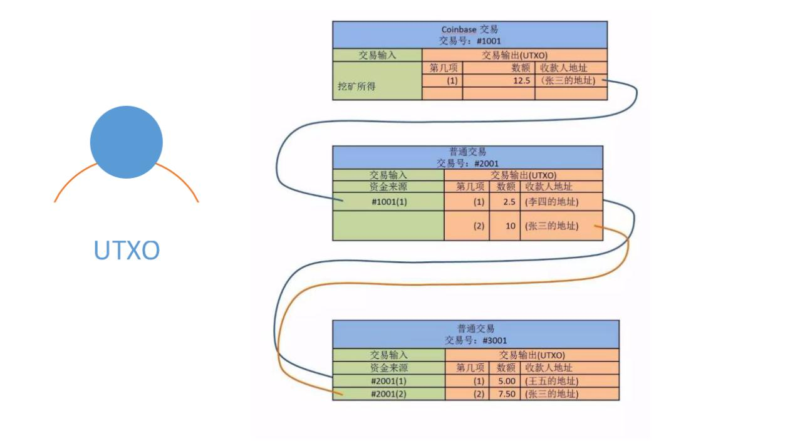
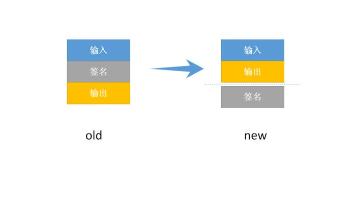

隔离见证是比特币升级方案的选项之一，硬分叉和软分叉都可以实现。由于硬分叉可能将分裂原来的比特币，所以这是一种比较激进的措施，大家目前还是期待一种更柔和的方式来解决这个问题。所以才有了被讨论得比较多隔离见证软分叉。

什么是隔离见证呢？隔离见证提出的背景是什么？

比特币核心开发员Pieter Wuille 在2015年12月於香港提出的，一方面是解决比特币存在的一个安全漏洞（延展攻击），一个是用于扩容。可以给大家举个例子：

比特币原来的交易数据结构里有签名和交易记录，把“输入”发到“输出”。“输入”里有支付者的签名。

现在打个比方。我去银行汇款，填了张汇款单，单子上写清楚了从我的中国银行账号汇100块钱给我爸爸的农业银行账号，然后我在单上签上我的名字，以授权这笔转账。银行的工作人员拿到这张单子后，就从我的账号上划走了100块钱，而在我爸爸的账号上则增加了100块钱。但我爸爸是看不到我汇款单上的签名的，银行不会拍一张照片给爸爸说，看这是你儿子的签名，是他授权了给你汇款的，只有银行才会关心我有没有授权。

怎么理解这个东西？隔离见证的英文全称是“Segregated Witness”，简写为SW。

从字面意思理解，就是把见证隔离开。其实这种叫法比较拗口，只不过当时别人提出这个方案是这么叫的，所以就沿用了这个叫法。在这里大家还是要回顾一下比特币的最重要的数据结构——UTXO，因为这个结构决定了比特币的诞生和消费，以及一个人能否支出和使用他的比特币。

UTXO也叫未花费交易的输出，意即每个币都是来自于没有被花费的输出，更进一步，每个输出都来自于上一个人或几个人的交易的输出，于是形成了一种输入输出结构。

所以，大家看到，在比特币这个最重要的信息里，主要有输入输出这两种信息。其实，里面还有个关键，就是在输入信息里，某个人为了证明他拥有这个比特币，所以他需要对自己的支出进行签名。这里面在给大家解释下，在A给B转账的过程中，一方面A要用自己的私钥进行签名表明能使用这个货币，另外还要指出收款方B的公钥地址，表明这笔钱是转给B的。

其实啊，这个结构里，这个签名信息占用了大量的字节，也就是说占用了比较多的空间。除了矿工需要验证这个签名之外，普通使用者只需要知道这个货币是否可用即可，也就是说，很多人并不需要这个信息。因此，才有了一种提案: 将这种签名信息隔离出来，UTXO里放一个指向这个签名信息的指针就行了。

这样一来，原来的空间就可以省出来，原来只能容纳1m大小的交易，现在可以容纳大概2m的交易了。虽然并不一定能永久解决比特币存在的容量限制问题，但是近两年应该不用担心了，为以后扩容方案广泛共识能争取时间。但是，比特币这种软分叉的共识也无法达成，因为支持率不够。

接下来说莱特币，莱特币最近暴涨，原因是什么？跟今天和大家讲的隔离见证有直接关系。莱特币的重要新闻：

1、实施SW软分叉升级，莱特全球圆桌论坛会议公告发布

2、莱特币创始人致矿工的一封信：隔离见证能够让我们东山再起

3、莱特币隔离见证支持率达70%
