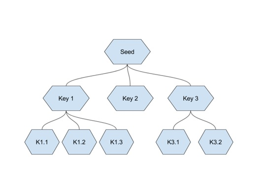
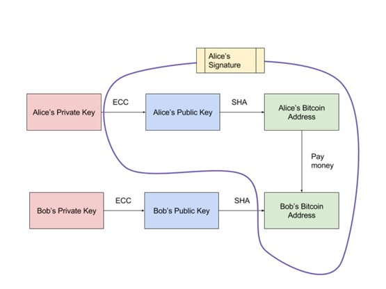
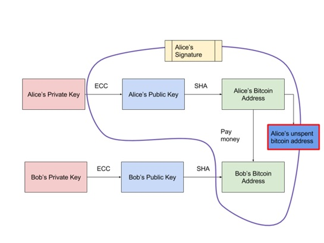

如何防止私钥泄漏？

1.1使用分层确定性钱包

在前面提到的比较多人使用的确定性钱包架构下，最广为人知的是HD钱包（ Hierarchical Deterministic 分层确定性钱包）

分层指的是一个总地址可以为下面的子单位创建不同私钥，子单位下面还可以为孙单位创建私钥做控管，这些地址会呈现树状的结构。全部批量私钥的产生，都来源于一个种子。

种子本身是一串很长的随机数，不利于记忆，所以很多钱包如imtoken会使用助记词 （Mnemonic）辅助，注记词算是种子的一种延伸，更方便保存和纪录。

HD钱包对私钥的最大保护在于，你不需要暴露任何私钥，就可以从一个父公钥生成所有的子公钥。私钥在一开始创建完主公钥后，就可以妥妥地拿去离线保存了。

在BIP44的规则下，HD 钱包非常强大，用户只需要保存一个种子，就能控制所有币种，所有账户的钱包。HD钱包最大的好处在于隐私性：HD 钱包通过在发送和接收资金时能够生成新地址，大大提高隐私性，使交易难以追踪。

1.2 使用多重签名

多重签名可以理解为一间企业的分层授权概念。当你需要提取超过限制的金额时，需要多把私钥同时授权，同时提升防盗，防丢的安全性。也就是说，”用 m 把钥匙生成一个多重签名的地址，需要其中的 n 把钥匙才能花费这个地址上的比特币，m >= n，这就是 n/m 的多重签名” 。所以，黑客偷走了一个私钥是不够的，得偷走好多个才行。

2.如何防止公钥被破解？

2.1保护公钥：使公钥不等于收发款地址

这个设计是比特币内置。中本聪设计了一个精妙的机制，即"公钥"并不直接等于比特币的收发款地址。

一般转帐流程是这样的：A付钱给B，A会就下图紫色框中的资讯进行签名后，进行全网广播，所以A的公钥和地址都是在网上公开可查的，至于收款方的B仅会公开他的收款地址。

虽然直接以公钥做为地址很方便，但万一有人用量子计算机成功从公钥反推回私钥，资金的安全将受到威胁。但今天如果公钥和地址之间又加了一层哈希算法，理论上从地址是无法倒推回公钥的（一个哈希值对应无数个明文，无法确定哪个是）。

2.2 更进一步保护地址：付款方会产生一个找零地址

每次A发起付款时，她原本的比特币地址就作废了，支付剩下的钱，会转到一个新的找零地址中，这样我就不担心我的比特币地址暴露在公开网站中了。

# 总结

1.生成HD Wallets钱包的时候除了会生成主私钥（master private key）和主公钥（master public key），还会生成一个chain code。

2.利用master private key + chain code可以得到指定的子私钥（sub private key）；

3.利用 master public key + chain code可以得到指定的子公钥（sub-public key）；

4.为了方便起见，HD Wallets引入了extended的概念，以方便使用。即：

扩展型私钥extended private key包含了private key和chain code

扩展型公钥extended public key包含了public key 和 chain code

5.每个private/public key可以派生出2^32个sub-private/public key,编号用index表示。而所有派生出来的sub-private/public keyy可以继续派生2^32个sub-sub private/public key，一直持续下去…… 这就有了层级（dept）的概念。

6.编号（index）和层级（dept）就构成了路径（PATH），就像我们的文件夹路径，不过这里的节点名都是数字。m(根节点)的派生出来的子节点的路径是m/0到m/2^32-1，而m/0派生出来的子节点是m/0/0到m/0/2^32-1 。

7.从上面几点很容易理解，假设要得到m/0/0的公钥，只需要m/0的公钥即可，而非一定需要m的公钥（即主公钥），私钥同理。
