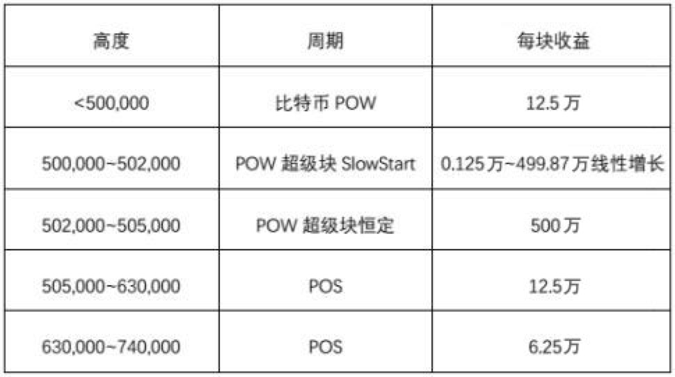
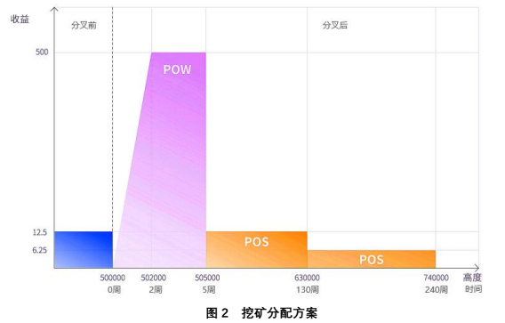

# 奖励机制

由加拿大区块链社区推出的节能版比特币BitECO引发币圈关注，除了先天具备的环保特性有望解决挖矿带来的碳排放污染问题，BitECO设定的生产机制带来的挖矿收益惊人，必将吸引众多矿工参与。

BitECO为何能为矿工带来高收益？主要有两点。首先，由于比特币采用的是POW机制进行挖矿，需要耗费大量算力进行工作量证明，整体的算力与价格都会受到市场影响，导致矿工收益波动明显。

BitECO将采用新的挖矿机制，货币总量为2100亿，预计在高度为500000的比特币区块链高度进行分叉，在此高度之后的5000个区块（约花费1个月时间）将产生 200亿的BitECO，占总币量的10%，矿工参与挖矿的收益可高达每区块500万BitECO。

其次，BitECO还规定，在分叉后的前2000个区块采用的是类似Zcash的SlowStart释放机制，以保证挖矿的公平性。

BitECO具体的挖矿机制分为POW SlowStart、POW恒定和POS三个阶段：

POW SlowStart阶段从高度500,000开始，持续2000个区块，约一周时间，每个区块收益会从0.125万开始，持续线性增长至499.875万。

POW恒定阶段从高度502,000开始，持续3000个区块，约三周时间，每块收益500万个BitECO，至此约1个月时间，共产生200亿个BitECO；

POS阶段剩余的币将按照POS机制挖出，按照目前比特币的减半机制，持续时间约5年：

简言之，BitECO的设计机制可为矿工带来远超比特币挖矿的收益，必将吸引更多矿工加入社区，共同构建一个可持续发展的BitECO社区。
