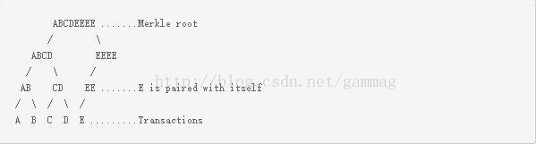

每个块必须包含一个或多个交易。这些交易中的第一个必须是一个币基交易，也称为生成交易，它应该收集并花费块奖励（包括块补贴以及由块中包含的交易支付的任何交易费用）。
币基交易的未花费的交易输出UTXO有一个特殊的条件，它至少需要100个块产生之后才能使用（用作输入）。这暂时阻止矿工花费从一个分叉链上以后可能被淘汰的区块（因此币基交易也被删除）上花费交易费和区块奖励。

区块不需要包括任何非币基交易，但是矿工几乎总是包含额外的交易，以便于获得他们的交易费。

包括币基交易在内的所有交易都以二进制原始交易格式编码入块。

原始交易格式被散列为交易标识符（txid）。通过这些txid，merkle树是通过将每个txid与另一个txid配对，然后将它们组合在一起构成的。如果有奇数个txids，那么没有合作伙伴的txid会使用自己的副本进行散列。
所产生的哈希本身每个都与另一个哈希配对，并且散列在一起。没有伙伴的哈希求自身的hash值。该过程重复，直到只剩下一个散列，这就是merkle根。

例如，如果交易仅是加入（不是求哈希），那么一个五个交易的merkle树将如下图所示：

根据在简单支付验证(SPV)子节的讨论， merkle树允许从一个完全分片的块头和一系列中间hash值得到的merkle根来验证区块中的一个交易。完整的分片不需要都被信任：伪造块头是昂贵的，中间哈希值不能被伪造或者会验证失败。

例如，为了验证事务D被添加到区块，SPV客户端除了merkle根之外只需要C，AB和EEEE散列的副本；客户不需要知道任何其他交易。如果这个块中的五个交易都处于最大值，下载整个块将需要超过500,000个字节，但是下载三个散列加上块头只需要140个字节。

注意：如果在相同的块中找到相同的txids，则可能merkle树可能与块，其中一些或所有重复项由于如何不平衡而被删除merkle树被实现（复制孤岛哈希）。由于使用相同的txids的单独事务是不切实际的，所以这不会对诚实软件造成负担，但是必须检查块的无效状态是否为缓存；否则，删除重复项的有效块可以具有相同的merkle根和块哈希，但被缓存的无效结果拒绝，结果在安全漏洞中，如CVE-2012-2459。
