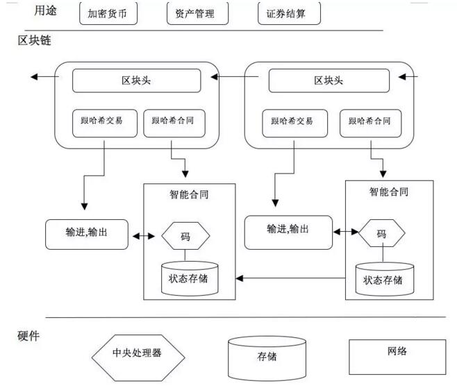
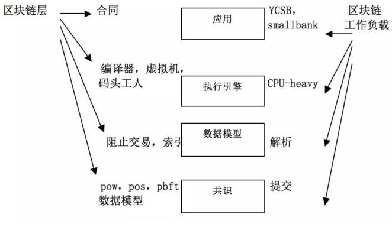

BLOCKBENCH:一种评估私有链的框架
# 摘要：

 区块链技术掀起了全球风暴。
 
 例如像比特币和以太坊这种公有链，启用了安全对等的应用程序，比如加密货币或者智能合约。
 
 他们的安全性和性能得到了很好的研究。这篇论文涉及到了最近的私有链系统设计，具有更强（好）的安全性假设和性能要求。
 
 这些系统的标准和目标是破坏到现在为止在数据库系统之上实现的应用程序，例如银行，金融和交易应用。
 
 在私有链的多个平台正在积极的开发和调整。然而，这里有一个明确的系统框架，可以对不同系统互相进行分析比较。
 
 像这样的一个框架可以用于评估区块链作为另一个分布式数据处理平台的可行性，同时帮助了开发人员发现瓶颈，相应的改善他们的平台。

 在论文里，我们第一个讲述了BLOCKBENCH，第一个分析私有链的评价框架。
 
 它作为一个公平的比较不同平台的方法，能够更加深入地了解不同的系统设计选择。
 
 任何私有链都可以通过简单的API函数集成到BLOCKBENCH当中，并且在真实和合成的智能合同的基础上进行负载。
 
 BLOCKBENCH在吞吐量，延迟，可扩展性的容错方面衡量整体和组件性能。
 
 接下来，我们使用BLOCKBENCH对以太坊，Parity和Hyperledger Fabric进行综合评估。结果表明，这些系统在传统的数据处理负载方面远远不能取代当前的数据库系统。
 
 此外，这三个系统之间的性能差距是因为不同层次的区块链软件设计。

 我们已经发布了给公众使用的BLOCKBENCH。
  
1、   介绍
区块链技术在过去几年里获得了巨大的发展，主要成功的原因是因为比特币和加密货币。

区块链，也被称为分布式分类账簿，本质上是由一组不完全信任的节点来维护的附加属性结构。

区块链网络中的所有节点都同意有序的区块集合，每个区块都包含很多个事务，所以区块链也可以被视为异常事务的日志。

在数据库环境中，区块链可以被视为分布式事务管理问题的解决方案：保留节点数据的副本，并且同意交易的执行顺序。

然而，传统的数据库系统在受信任的环境中工作，并且采用众所周知的并发控制技术来订单交易。区块链的关键优点它不会假设互相信任的节点，因此来实现设计占拜庭容错。
 
在原来的设计中，比特币区块链把币存储为系统状态，并与所有参与者共享。

对于这个简单的应用，比特币节点实现简单的复制模型，简单地将硬币从一个地址移动到另外一个地址。

从此以后，区块链快速增长，以支持用户自定义和完整地状态模型。以太坊是一个众所周知的例子，所有分散的复制应用程序称为智能合约。

更重要的是，业界已经开始推动专为私人设计的嵌入式平台的开发参与者进行身份验证的设置。这种环境中的区块链系统称为私有（或者许可），而不是在任何人都可以加入或者离开的公共环境中运行的早期系统。

安全交易和结算申请，资产和财务管理，银行和保险正在建设和评估。

这些应用程序目前有企业级数据库系统（如Oracle和MySQL）支持，但是区块链可能会破坏这种现状，因为它会降低基础设施和人力成本。

尤其是不变性和透明度有助于减少人为错误和因为确定数据而需要人工干预。

区块链可以通过删除数据治理中的重复工作来帮助简化业务流程。高盛估计目前资本市场节省60亿美元，摩根大通预测，截止到2020年，区块链将开始取代目前的冗余基础设施。
 
鉴于在数据库技术已经占主导地位的情况下采用区块链这一趋势，要提出的一个问题是在区块链在多大程度上可以处理数据工作量。

另一问题是今天可以选择许多平台，尽管区块链是一个开放的协议，但是在实现细节上还是有不同。

在这项工作中，我们开发了一个名为BLOCKBENCH的框架来解决这两个问题。BLOCKBENCH是学习和比较许可链性能的第一个基准。

虽然许可链中的节点仍然不能相互信任，它们的身份被认证，这使得系统可以使用更有效的协议来行使拜占庭容错而不是公开设置。

我们不把公有链作为研究焦点，因为它们的表现（以及权衡安全保障）是比较好研究的。

我们的框架不仅对应用程序开发人员有用，以评估区块链满足应用需求的潜力，而且还为平台开发人员提供了远见：帮助他们识别和改进性能瓶颈。
 
我们在开发BLOCKBENCH面临三大挑战。

第一，区块链系统包括许多部分，我们观察到，几乎每个细节都在不同平台之间进行了各种各样的设计选择。

在BLOCKBENCH，我们将区块链结构分为三个模块层次，并将其研究集中在它们上：共识层，数据模型和执行层。

第二，平台有很多不同的选择，但并不是全部都达到了成熟的设计，实施和已建立的用户群。

为了这些，我们首先从考虑的三个最成熟的平台设计来设计BLOCKBENCH，亦即以太坊，Parity和Hyperledger，然后推广到支持未来的平台。

这三个平台都支持智能合约并且可以被部署在私有环境里。

第三，缺乏数据库导向的区块链工作量证明。

虽然在公有链上可以找到真正的以太坊交易和合约，目前还不清楚这样的工作量是否足够有代表性来评估区块链的一般数据处理能力。

为了解决这个挑战，我们将区块链作为一个键值存储与引擎相结合，可以通过智能契约实现事务和分析功能。

然后，我们基于实际和合成数据来设计和运行事务和分析工作负载。
 
BLOCKBENCH是一个灵活和可扩展的框架，提供了一些加载机制，并附有以太坊，Parity和Hyperledger作为后端。

加载机制目前是针对交易量的，旨在支持数据库式应用程序的宏基准和微基准块。

具体来说，当前的宏基准测试包括一个键值，一个OLTP加载机制和一些真正的以太坊智能合约的加载机制。

对于每个共识，数据和执行层至少有一个微基准加载机制来孤立地测量其性能。比如，用于执行层，BLOCKBENCH提供了两种加载机制：测试智能合同I / O和计算速度的加载机制。

新的加载机制和区块链可以通过一组简单的API轻松集成。

BLOCKBENCH在几个维度量化后端系统的性能，包括：吞吐量、延迟、可扩展性和容错能力。

它支持模拟网络攻击的安全评估。使用BLOCKBENCH我们对两个宏基准和四个微基准工作负载的三个区块链系统进行了深入的比较。

结果表明，区块链系统的性能有限，远远低于最先进的数据库系统的预期（比如H-店）。

在七个基准测试中，其他两个系统的表现总是胜过Hyperledger。但是它不能超过16个节点。

我们的评估表明，协商一致的协议解释了以太坊和Hyperledger应用层的性能差距。我们还确定了以太坊和Parity的执行和数据层的处理瓶颈。最后，我们的评估也揭示了以太坊和Parity的执行和数据层的瓶颈。
 
 综上所述，我们的贡献是：

我们提出了第一个用于理解和比较许可的区块链系统性能的基准框架。我们已经公布了公共使用的框架。

对以太坊，Parity和Hyperledger进行综合评估。我们的实证结果提供了区块链处理数据处理加载机制方面局限性的具体证据，并揭示三大制度的瓶颈。

该结果作为区块链技术进一步发展的基准。

 在下一节中，我们更详细地讨论区块链系统。第3节描述BLOCKBENCH设计和实施。第4节介绍了我们对三个系统的比较性能研究。我们从第5节的结果和第6节的相关工作中讨论经验教训，我们在第7节总结。
 
2、   私有链
典型的区块链系统由不完全相互信任的多个节点组成。

一些节点表现出拜占庭式行为，但大多数是诚实的。

节点一起维护一组共享的全局状态，并执行修改状态的事务。区块链是一种维护状态和历史交易的特殊数据结构。

系统中的所有节点都同意存储在区块链上的事务及其顺序。因此，区块链通常被称为分布式分类帐。

 区块链交易。区块链中的事务与传统数据库中的事务相同：在一些状态下应用的一系列操作。
 
 因此，区块链事务需要相同的ACID语义。关键的区别在于正在考虑的故障模式。当前事务性分布式数据库采用传统的并发控制技术，例如两阶段提交来确保ACID。
 
 它们可以实现高性能，因为简单的故障模型，既而奔溃失败。
 
 相比之下，原始的区块链设计考虑到节点是拜占庭式很恶劣的环境，并且它们可以自由地加入和离开。在这种模式下，并发控制的开销要高得多。

 比特币。比特币（加密货币）状态是网络中可用的数字硬币。
 
 比特币交易将硬币从一组地址移动到另一组地址。
 
 每个节点广播一组它要执行的事务。称为矿工的特殊节点将事务收集到区块链中，检查其有效性，并启动协商协议将块附加到区块链。

图1:区块链软件堆栈在完全验证的节点上。非验证节点仅存储块头。不同的区块链平台在区块链和应用层之间提供不同的界面。

显示了区块链数据结构，其中每个块通过加密指针链接到其前身，一路回到第一（创世纪）区块。

比特币使用工作量证明达成共识：只有成功地解决了计算难题的矿工（找到块标题的正确随机数）才能追加到区块链。     

PoW容忍拜占庭故障，但它本质上是概率性的：可能同时附加两个块，在区块链中创建一个岔。

比特币通过仅在考虑块之后才确定这一点，之后是多个块（通常为6个块）。

这种概率保证会导致安全性能和性能问题：攻击已经被对手控制了25％的节点所证明，而比特币事务吞吐量仍然很低（每秒7个事务）。
 
以太坊。由于简单的事务语义，比特币节点执行预构建到协议中的非常简单的状态机。

以太坊扩展比特币以支持用户定义和图灵完成状态机。

尤其是，以太坊区块链让用户以智能合同的形式定义任何复杂的计算。除了区块链的共享状态（例如密码币）之外，每个智能合约都可以访问自己的状态。

图1展示显示了典型以太坊中的软件堆栈节点：完全验证的节点包含区块链的整个历史，而非验证节点仅存储块头。与比特币的一个主要区别是，智能合同状态以及正常交易都得到维护。

事实上，一个智能合同是通过一个独特的地址来识别的，它具有自己的货币余额（在以太网络中），并且在检索一个交易的地址时，它执行合同的逻辑。

以太网配备执行引擎EVM来执行智能合约。

图2显示了一个在以太坊上运行的流行合约片段，该协议实施了一个金字塔计划：用户向此次合约汇款，用于向早期参与者支付利息。

该合约有自己的状态，即参与者名单，并出口一个名为enter的函数。用户通过交易发送他的钱来调用此合约，由发送者和金额访问的智能合约访问。
 
私有链。

以太坊使用与比特币相同的协议，尽管具有不同的参数。实际上，90％的公链系统采用工作量证明协议的变体。

PoW是非确定性的和算力消耗大的，这使得它不适合于诸如银行和金融的应用，其必须以确定性方式处理大量交易。

最近的块链系统，例如Hyperledger，考虑限制的设置，其中节点被认证。

尽管在这种许可的环境中，PoW仍然是有用的，如在以太坊的情况下，存在节点身份已知的更有效和确定性的解决方案。

在这种封闭设置中的分布式容错共识是分布式系统中一个很好研究的主题。Zab，Raft，Paxos，PBFT是目前正在使用的流行协议。

最近被许可的区块链使用现有的PBFT，如同Hyperledger，或开发自己的变体，如Parity，Ripple和ErisDB。

这些系统中的大多数都支持使用不同语言的不同API和执行引擎的智能合同（参见附录中更为全面的比较）。

因此，获得了许可的区块链可以比基于PoW的区块链更有效地执行复杂的应用程序，同时也是拜占庭式容错的。

这些财产和主要银行和金融机构的商业利益已经给私人封锁带来了破坏当前数据管理实践的潜力。
 
3、   区块链设计
本节讨论块链的常见抽象层次和基准工作负载。

图3：区块链中的抽象层，以及BLOCKBENCH中的相应工作负载

3.1区块链层
有很多区块链的选择：超过200比特币变体，以太坊和其他许可的块链。

为了有意义地比较它们，我们确定了所有这些系统中（图3）发现的四个抽象层，并设计了我们的加载机制来定位这些层。

协议层包含协议，通过该协议块被认为附加到区块链。数据层包含区块链接数据的结构、内容和操作。

执行层包括支持区块链操作的运行时环境的细节。

最后，应用层包括区块链应用的类别。在相关工作中，Croman等人提出将区块链分为几个平面：网络，共识，存储，视图和侧面。

虽然类似于我们的四个层次，平面抽象是面向加密货币应用程序，并没有考虑到智能合约的执行。我们的图层更准确地模拟了私有区块链的真正实现。

我们现在轮流讨论这些层。
 
3.1.1共识

共识层的作用是使系统中的所有节点对区块链内容达成一致。也就是说，如果一个节点附加（或提交）一个块，其他节点也将相同的块附加到其块的副本中。

在崩溃故障模型中达成共识的协议在分布式数据库中发挥关键作用，其中节点同意全局事务顺序。

另一方面，区块链系统采用一系列拜占庭容错协议。

在同一个极端，像比特币一样，以太坊使用工作中的工作难易程度来逐步调整，以达到每14s（目前）一个块的速度（比特币的差距达到每10秒一个块的速度）。

本质上，PoW在每一轮选择可以附加块的随机节点，其中被选择的概率由节点的总计算能力确定。这个简单的方案适用于Sybil攻击-开放，分散的环境中的对手攻击，敌对方可以获得多个身份。

然而，它消耗了大量的能量和计算能力，因为节点花费他们的CPU周期来解决谜题，而不是做其他有用的工作。更糟糕的是，它不能保证安全：两个节点都可以选择附加到区块链，并且两个块都可以被接受。

这导致fork在区块链中大多数基于PoW的系统添加附加规则，例如，只有最长链上的块被认为是接受的。以太坊，特别地，采用称为GHOST的PoW变体，其接受重分支中的块。在任何情况下，一个块只能以某种高概率被确认为区块链的一部分。

在另一个极端，Hyperledger使用经典的PBFT协议，其通信约束：O（N2）其中N是节点数。

PBFT可以容忍少于N/3个故障，并且在三个阶段中工作，节点间相互广播消息。首先，预先准备阶段选择一个提交值的领导者。然后，准备阶段广播要验证的值。

最后，提交阶段等待多于两个节点的确认，然后才宣布该值被提交。PBFT已经被证明在部分异步模型中实现活跃性和安全性，因此，与PoW不同，一旦附加了块，就立即被确认。

它可以容忍比PoW更多的故障（这显示容易受到25％的攻击）。然而，PBFT假定节点身份是已知的，因此它只能在被许可的设置中工作。

此外，由于其通信开销，协议不太可能扩展到以太坊的网络大小。

在此之间，有各种混合设计结合了PoW的可扩展性和PBFT的安全性能。例如，Bitcoin-NG通过使用PoW进行领导选举来解除事务验证的共识，然后可以一次添加多个块。类似地，Byzcoin和Elastico利用PoW来确定运行PBFT的随机，较小的共识组。

另一个例子是ErisDB采用的Tendermint协议，该协议结合了证据（PoS）和PBFT。不像PoW，PoS称为授权证明（或PoA）。

在该协议中，一组权限是预先确定的，并且每个权限被分配一个固定时隙，在该时隙内它可以生成块。PoA强调了当局的信任，因此只适用于私人部署。

3.1.2数据模型     

在比特币中，交易是一等公民：它们是表示网络中数字硬币的系统状态。私链从这个模型出发，重点关注账户。

一个直接简单的好处——特别是对于涉及加密货币的应用程序。

例如，在比特币中将货币从一个用户转移到另一个用户涉及搜索属于发件人的交易，然后将其中的一些标记为已用，而在以太坊中可以通过在一个交易中更新两个帐户轻松完成。以太坊的帐户余额作为其状态，并在收到交易后更新。

称为智能合约的特殊类型的帐户包含可执行代码和私有状态（图1）。当收到交易时，除了更新其余额之外，合约的代码将使用交易中指定的参数进行调用。

代码可以读取其他非合同账户的状态，并且可以在执行期间发送新的事务。奇偶性采用与以太坊相同的数据模型。在Hyperledger称为chaincode和以太网合同相同。chaincode只能访问其私有存储，并且隔离彼此。
 
一个块包含事务列表，以及执行的智能合约列表以及其最新状态。每个块由其内容的加密哈希识别，并且与先前的块的身份相关联。

在Parity，整个块内容被保存在内存中。以太坊和Hyperledger，内容被组织成两层数据结构。

这些状态存储在基于磁盘的键值存储（以太坊中的LevelDB和Hyperledger中的RocksDB）并且组织在一个散列树中，其根部包含在区块头中。以太坊将状态缓存在内存中，而Hyperledger将其数据管理完全外包给存储引擎。

受区块的事务影响的状态只记录在根散列中。事务列表的散列树是一个经典的Merkle树，因为列表不大。另一方面，状态树使用不同的Merkle树变体。

以太坊和Parity采用Patricia-Merkle树，支持高效的更新和搜索操作。Hyperledger实现Bucket-Merkle树，它使用散列函数将状态分组到一个从其构建Merkle树的桶列表中。

块标题和关键值存储一起保持所有区块链的历史事务和状态。为了验证和执行事务，区块链节点仅需要几个最近的块（或者仅仅是基于PBFT的系统的最新块）。

然而，节点还通过一些类似RPC的机制与没有整个区块链的轻量级客户端进行交互。这样的外部接口可以在区块链上建立第三方应用程序。

当前系统支持最小的查询集，包括根据其ID获取块和事务。以太坊和Parity通过JSON-RPC公开更全面的API，支持特定块处的帐户状态查询和其他块统计信息。
 
3.1.3执行层

在运行时环境中执行合约（或链码），要求是执行必须是快速的，因为在一个块中有多个合同和事务，并且它们都必须由节点进行验证。另一个原因是执行必须是确定性的，理想情况下在所有节点上都是相同的。

确定性执行避免事务输入和输出中的不一致性，导致块被中止。在PoW和PBFT中，中止交易浪费了计算资源。
 
以太坊开发自己的机器语言（字节码）和用于执行代码的虚拟机（称为EVM），这也被Parity采用。

EVM针对特定于以太坊的操作进行了优化。例如，每一个执行的代码指令都要花费一定量的gas，并且总成本必须被正确跟踪并收取到交易的发件人。

此外，代码必须跟踪中间状态，并且如果执行用尽气体则将其反转。Hyperledger相比之下，它不会在设计中考虑这些语义，所以它只是支持在Docker图像内运行编译的机器代码。

具体来说，链码被部署为通过预定义接口与Hyperledger后端交互的Docker图像。Hyperledger的环境的一个优点是它支持多种高级编程语言，如Go和Java，而不是以太坊自己的语言。

在开发环境方面，Hyperledger仅暴露了简单的关键值操作，即putState和getStare。这是受限制的，因为任何合同状态必须映射到关键值元组中。

这是受限制的，因为任何合同状态必须映射到关键值元组中。这是受限制的，因为任何合同状态必须映射到关键值元组中。
 
3.1.4 应用层
许多应用正被热情地提议结合区块链技术，利用区块链突出的关键属性。

首先，区块中的数据对于参与者是不可变和透明的，这意味着一旦添加了记录，就不可能更改。

其次，它对不诚实和恶意的参与者是有弹性的。即使在许可的环境中，参与者也可以相互不信任。

然而，最流行的应用程序仍然是加密货币。以太坊有自己的货币（以太币），并且大部分在其上运行的智能合约都是货币相关的。

DAO是以太坊最积极的应用，为群众资助，交流，投资或任何其他分散活动创造了社区。

DAO基金来自于参与者贡献的资金，并使参与者的投票权与其贡献成比例。Parity的主要应用是管理以太网的钱包应用程序。

由于主要是银行正在考虑采用加密货币，一些金融技术公司正在采用加密货币来调解金融交易，例如在可靠的交易市场。其他的例子包括应用货币和智能合约来进行更透明和更具成本效益的资产管理。
 
一些应用基于区块链不可篡和透明的特性，可以使目前的应用更好地完善在工作流程中无法避免的瓶颈。

另一个例子是共享经济应用：如AirBnB，它可以使用区块链来评估在分散在各地的运营商的声誉和信誉，因为任何用户的历史活动是可用的和不可改变的。所以这个延伸到物联网设置，在器件需要建立相互信任的互联网。

http://www.qukuaiwang.com.cn/news/3178.html

http://www.comp.nus.edu.sg/~dbsystem/blockbench/index.html
