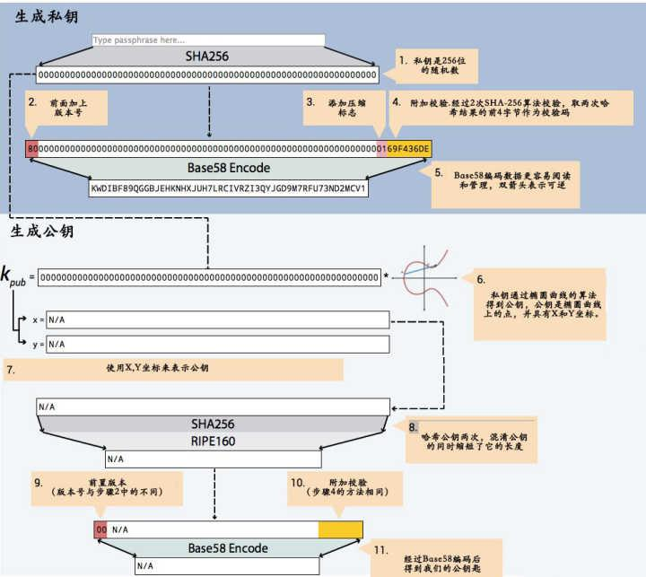
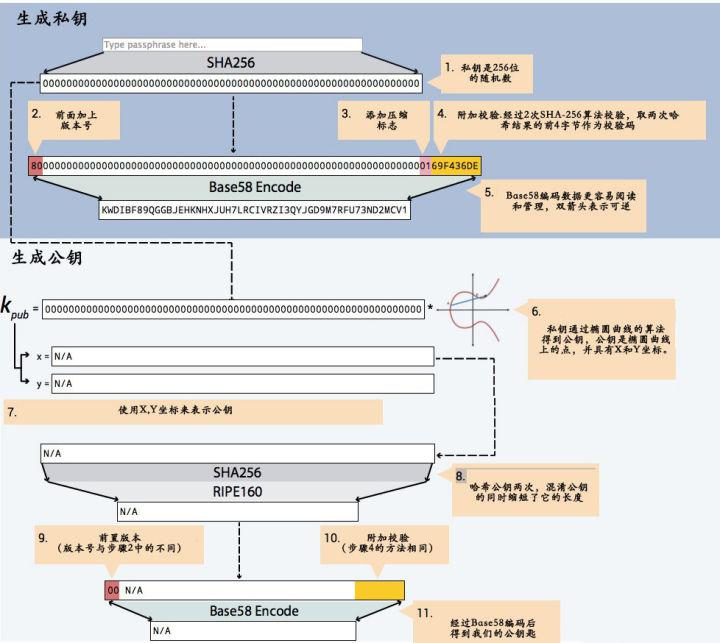

基于椭圆加密的原理，由私钥是可以计算出公钥的，再由公钥经过一系列数字签名运算就会得到比特币钱包地址。

因为由公钥可以算出比特币地址，所以我们经常把公钥和比特币地址的说法相混淆，他们都是指的同一个概念，比特币钱包地址只是另一种格式的公钥，但是两者的外在表现形式是不一样的。

那么我们就可以梳理出一个脉络了：
私钥 —— 公钥 —— 比特币钱包地址

从比特币私钥得到我们日常转账所用的比特币钱包地址总共需要九个步骤，中间用到了SHA256加密、RIPEMD160加密和BASE58编码。

下面，我们以实际案例来模拟一下整个流程：

第一步：生成随机私钥

私钥是一个随机数，随机选取一个32字节的数，这个数的范围大小是介于1 ~ 0xFFFF FFFF FFFF FFFF FFFF FFFF FFFF FFFE BAAE DCE6 AF48 A03B BFD2 5E8C D036 4141之间的一个数，为了方便后面的计算，我们随机生成一个合法的私钥：

8F72F6B29E6E225A36B68DFE333C7CE5E55D83249D3D2CD6332671FA445C4DD3

第二步：椭圆曲线算公钥

生成了私钥之后，我们使用椭圆曲线加密算法（ECDSA-secp256k1）计算私钥所对应的非压缩公钥，生成的公钥共65字节， 其中一个字节是0x04，其中32个字节是X坐标，另外32个字节是Y坐标：

公钥P.X：
06CCAE7536386DA2C5ADD428B099C7658814CA837F94FADE365D0EC6B1519385

公钥P.Y：
FF83EC5F2C0C8F016A32134589F7B9E97ACBFEFD2EF12A91FA622B38A1449EEB

第三步：计算公钥的SHA-256哈希值

将上述公钥地址拼合，得到标准地址：

0406CCAE7536386DA2C5ADD428B099C7658814CA837F94FADE365D0EC6B1519385FF83EC5F2C0C8F016A32134589F7B9E97ACBFEFD2EF12A91FA622B38A1449EEB

对齐进行SHA-256哈希计算，得到结果：

2572e5f4a8e77ddf5bb35b9e61c61f66455a4a24bcfd6cb190a8e8ff48fc097d

第四步：计算 RIPEMD-160哈希值

取上一步结果，进行RIPEMD-160计算，得到结果：

0b14f003d63ab31aef5fedde2b504699547dd1f6

第五步：加入地址版本号（比特币主网版本号“0x00”）

取上一步结果，在前面加上16进制的00，即：

000b14f003d63ab31aef5fedde2b504699547dd1f6

第六步：计算 SHA-256 哈希值

取上一步结果，进行SHA-256计算，可得：

ddc2270f93cc84cc6869dd373f3c340bbf5cb9a8f5559297cc9e5d947aab2536

然后，对以上结果再次计算 SHA-256 哈希值，得到：

869ac57b83ccf75ca9da8895823562fffb611e3c297d9c2d4612aeeb32850078

第七步：取上一步结果的前4个字节（8位十六进制）

869ac57b

第八步：把这4个字节加在第五步的结果后面

作为校验位，将这4个字节加载第五步的结果后面，这就是比特币地址的16进制形态了：

869ac57b000b14f003d63ab31aef5fedde2b504699547dd1f6

第九步：用Base58编码变换一下地址

对上一步的结果进行Base58编码，得到：

1QCXRuoxWo5Bya9NxHaVBArBQYhatHJrU7

这就是我们经常看到的传统意义上的比特币钱包地址了。

以上步骤可以简化为下图所示：

我们经常说的比特币公钥就是指的图中第二步所产生的结果，而HASH160指的是第四步RIPEMD160签名所产生的结果，由于RIPEMD也是一种HASH算法所以就统称为HASH160了，而我们常用的比特币地址就是经过BASE58编码后的结果。
